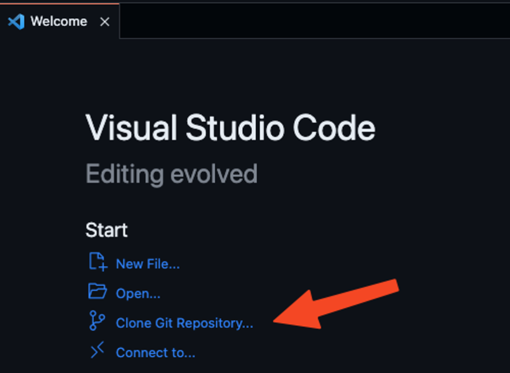

# kenober

> Stack : Astro, TinaCMS, TailwindCSS.

## Installation

Prérequis : 1 compte GitHub + 1 invitation (acceptée)

### Installation du poste :

1. ~~Docker desktop : https://www.docker.com/products/docker-desktop/ (redémarrage requis)~~
2. Git : https://git-scm.com/downloads
3. VSCODE https://code.visualstudio.com/download
   1. Depuis VSCODE, dans extension, installer ~~`ms-vscode-remote.remote-containers`~~ , `GitHub.remotehub`

### Installation du projet

1. ~~Lancer Docker desktop~~ ;
2. Lancer VSCode ;
3. Copier le code du projet en le clonant. Cliquer sur `Clone Git Repository` et renseigner l’URL du repository GitHub ;
4. Créer un fichier `.env` contenant `SITE_URL=https://fake.kenober.tld` (l'url n'est pas importante).
5. Dans le terminal (Dans le menu `Terminal`, faire `New terminal`), tapez `npm ci` si ça ne fonctionne pas, faite `npm i`.

### Lancer le projet en local

1. Dans le terminal (Dans le menu `Terminal`, faire `New terminal`), tapez `npm run dev`
2. Pour voir le site ou lancer le CMS, utilisez les urls ci-dessous :

- CMS : http://localhost:4321/admin/index.html#
- Index: http://localhost:4321/

### Valider avant d'envoyez les fichiers sur GitHub et publier

1. Dans le terminal (Dans le menu `Terminal`, faire `New terminal`), tapez `npm run build`

**Si ça plante, l'erreur est souvent explicite...**

### Publier sur GitHub

1. Dans la vue `Source Control` (`View` > `Open view` > `view Source Contol` + [ENTER])
2. Mettez un message parlant de ce que vous venez de faire
3. Cliquez sur `Commit`
4. Cliquez sur `Synchronize`.

---

[@novagaia 2024](https://novagaia.fr/)
